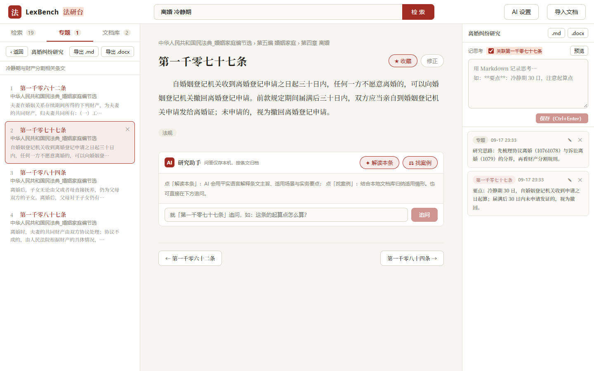

# LexBench · 法研台

**本地优先的个人法律研究工作台** —— 导入、检索、收藏、笔记、AI 辅助，全流程一个界面完成。你的文档、笔记、配置全部保存在本机，不上传任何服务器。

> **English** — LexBench is a local-first legal research workbench: import your Word/PDF statutes and cases, locate articles by number ("民法典 1077"), run full-text search with highlights, collect articles into research topics with Markdown notes, and ask an OpenAI-compatible AI assistant to explain any article with clickable citations. Ships as a portable Windows desktop app (no Python needed) — all data stays on your machine.

## 界面预览

| 法条定位 + AI 助手 | 全文检索 | 研究工作台 |
|---|---|---|
|  |  |  |

## 下载安装（推荐）

1. 打开 [Releases 页面](https://github.com/a1531307144-cell/LexBench/releases)，下载最新的 `LexBench-x.x.x-windows-x64.zip`
2. **解压**压缩包到任意文件夹（如桌面）
3. 双击 `LexBench.exe` —— 打开的是独立软件窗口，无需安装 Python，也不占用浏览器

**常见问题**

- **Windows 提示"已保护你的电脑"**：本软件是个人开源项目，没有购买微软代码签名证书（每年数百美元），所有个人开源软件都会遇到。点「更多信息」→「仍要运行」即可；全部源代码公开可查
- **你的数据在哪**：全在 LexBench.exe 旁边的 `data\` 文件夹里。换电脑 = 整个文件夹拷走；卸载 = 直接删除
- **双击没反应**：确认已解压（不要在压缩包里直接双击）；窗口打不开时按提示安装微软 WebView2 运行时

> 示例数据：仓库 [samples/](samples/) 目录有《民法典》婚姻家庭编节选等示例文本，拖进软件窗口即可体验全部功能。

## 从源码运行（开发者）

前置要求：Windows + Python 3.10+（无需 Node.js，前端已预构建）

```
1. 双击 start.bat（首次运行自动创建虚拟环境并安装依赖）
2. 浏览器自动打开 http://127.0.0.1:8788
```

源码模式下也可预览桌面窗口形态：`pip install -r backend/requirements-desktop.txt` 后运行 `python desktop.py`。

> 《民法典》婚姻家庭编节选示例：试试搜索 `民法典 1077`（法条定位）和 `离婚 冷静期`（全文搜索）。

## 功能

- **文档导入**：拖拽导入 Word (.docx) / PDF / 纯文本 (.txt) 法律文档，自动按"第X条"切分建库（法规 / 案例 / 其他资料三种类型）；内容哈希去重；解析异常自动标记"需复查"
- **双模式检索**：
  - 法条定位 —— 输入 `民法典 1077` 直接跳到《民法典》第一千零七十七条；法规名支持简写（`民诉法` → 《民事诉讼法》）
  - 全文搜索 —— 中文分词 + bm25 排序，关键词高亮与上下文摘要
- **研究工作台**：按专题（如"离婚财产分割"）★ 收藏法条，专题内逐条浏览，右栏 Markdown 笔记（可关联具体法条），一键导出 Markdown / Word 研究报告
- **AI 研究助手**：接入任意 OpenAI 兼容接口（DeepSeek / 通义 / Kimi 等），在法条页一键「解读本条」「找案例」或自由追问；回答中的《法规名》第X条引用可点击跳转核对；问答按条文存档本机
- **条文修正**：解析有误的条文可直接在阅读器内修正，全文索引同步更新

## AI 助手配置（可选）

1. 点击右上角「AI 设置」，填入 OpenAI 兼容接口地址（如 `https://api.deepseek.com/v1`）、模型名与 API Key，点「测试连接」验证
2. 打开任意法条，在正文下方「AI 研究助手」面板使用三个功能
3. API Key 只保存在本机 `data/` 目录的数据库中，不会上传 GitHub、不写入任何日志；AI 调用只发生在你主动配置之后

## 开发

```
backend:  cd backend && pip install -r requirements.txt && pytest
frontend: cd frontend && npm install && npm run dev
桌面打包: powershell -ExecutionPolicy Bypass -File scripts\build_desktop.ps1
```

详细设计见 [docs/plans/2026-09-17-lexbench-design.md](docs/plans/2026-09-17-lexbench-design.md)。

## 发布流程（维护者）

对外发布（push / 打 tag / Release）前必须走 [docs/RELEASE_CHECKLIST.md](docs/RELEASE_CHECKLIST.md) 审批：

```
python scripts/security_check.py --history --strict   # 第一关：自动扫描隐私与密钥
人工复核 RELEASE_CHECKLIST.md 清单                     # 第二关：逐项确认
```

CI 会在每次推送时自动复检测试与安全扫描，本地漏掉的会被拦截。

## 许可

代码采用 [MIT License](LICENSE)。你的法律文档、笔记、AI 配置等数据全部保存在本地 `data/` 目录，不上传、不入库。
