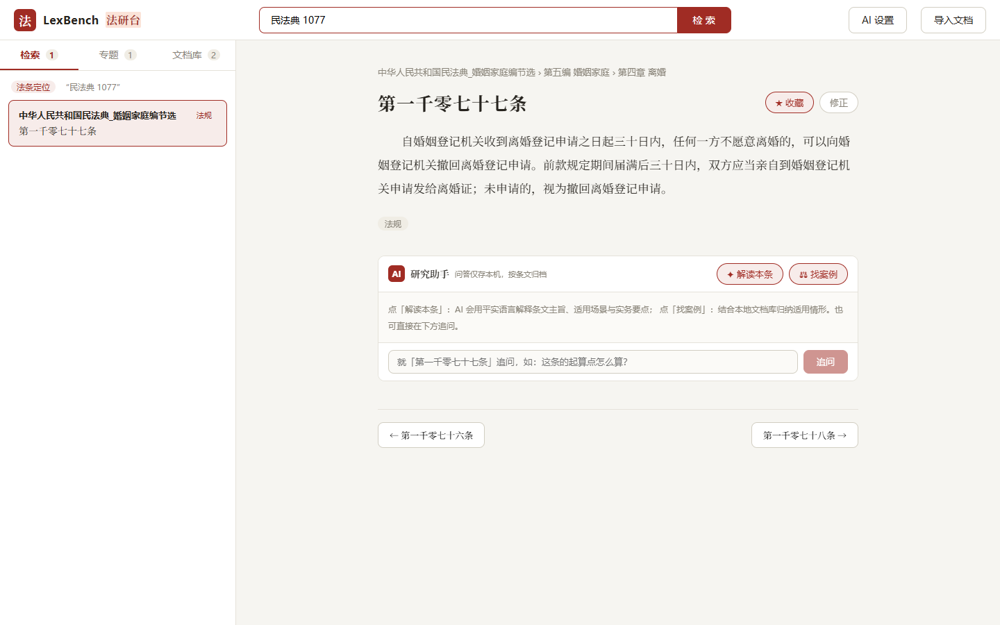
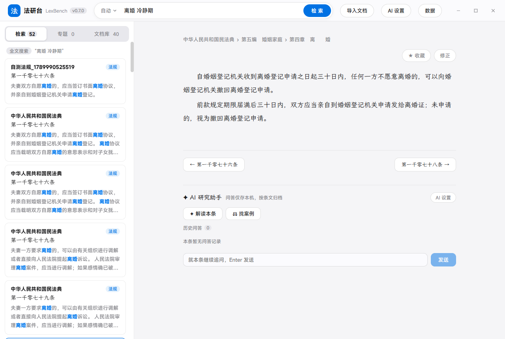
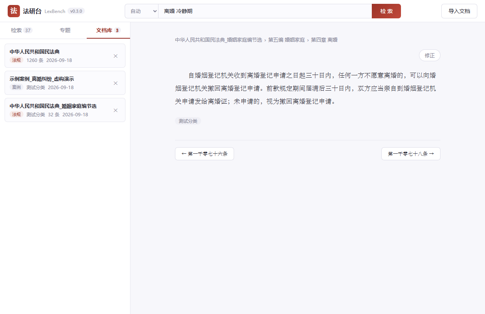
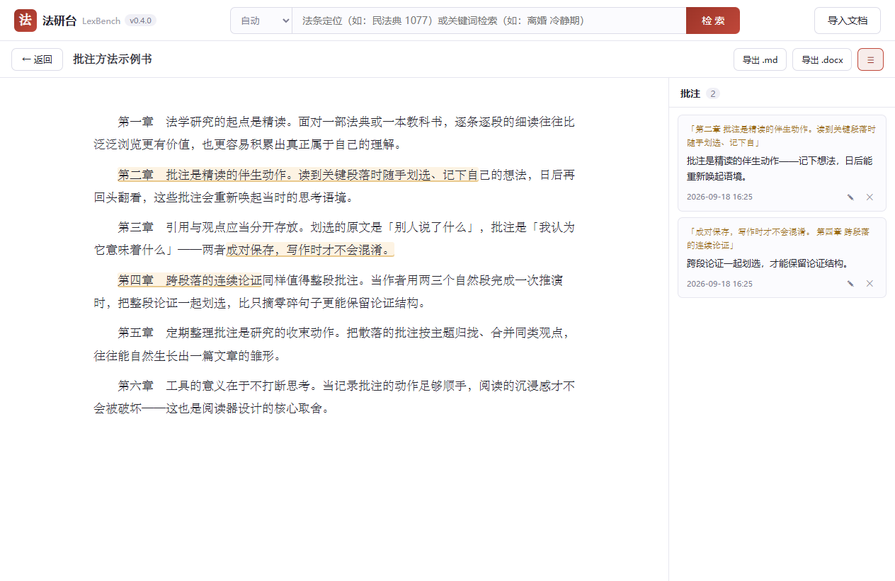

# 法研台 · LexBench

**本地优先的个人法律研究工作台** —— 导入你的 Word / PDF / TXT 法律文档，自动按「第X条」切分建库；输入「民法典 1077」直接跳到那条法条；全文检索带高亮与摘要；条文可随手修正。你的文档、数据、配置全部保存在本机，不上传任何服务器。

> **English** — LexBench is a local-first legal research workbench for Chinese law: import your Word/PDF/TXT statutes and cases, locate articles by number ("民法典 1077"), run full-text search with highlights and snippets, and correct mis-parsed articles in place. Ships as a proper Windows installer with auto-update — all data stays on your machine.

## 界面预览

| 法条定位 + 阅读 | 全文检索 | 文档库 | 阅读模式（划选批注） |
|---|---|---|---|
|  |  |  |  |

## 下载安装

1. 打开 [Releases 页面](https://github.com/a1531307144-cell/LexBench/releases)，下载最新的 `LexBench-Setup-x.x.x.exe`
2. 双击安装（可选安装位置），桌面与开始菜单自动创建快捷方式
3. 有新版本时软件会**提示你**决定是否下载安装（绝不擅自下载）

**常见问题**

- **Windows 提示"已保护你的电脑"**：本软件是个人开源项目，没有购买微软代码签名证书（每年数百美元），所有个人开源软件都会遇到。点「更多信息」→「仍要运行」即可；全部源代码公开可查
- **你的数据在哪**：全在本机用户数据目录（数据库 + 原件归档），卸载软件也不会动它
- **换电脑 / 备份**：顶栏「数据」→ 导出数据包（数据库 + 全部原件 + AI 配置打成一个 zip）；新电脑装好后「导入数据包」即可整包恢复，导入前会自动备份当前数据

## 功能

- **文档导入**：拖拽或点选导入 Word (.docx) / PDF / 纯文本 (.txt)，导入时可选类型（自动识别 / 法规 / 案例 / 书籍资料 / 其他资料），法规自动按「第X条」切分建库（编 / 章 / 节层级齐全，支持「第一千零七十七条」与「之X」变体）；内容哈希去重；解析异常自动标记「需复查」并支持一键标记已复查
- **双模式检索**（可手动切换或用自动模式）：
  - 法条定位 —— 输入 `民法典 1077`、`公司法 第51条` 或 `民法典第一千零七十七条` 直接跳到条文；法规名支持简写（`民诉法` → 《民事诉讼法》）
  - 全文搜索 —— 中文分词 + bm25 相关度排序，关键词高亮与上下文摘要，多关键词部分命中也召回
- **阅读器**：编/章/节面包屑、衬线条文排版、上一条/下一条翻页、文档目录浏览
- **条文修正**：解析有误的条文可直接在阅读器内修正，保存后全文索引同步更新
- **研究工作台**：专题收藏（★、去重、排序）、双类型笔记（关联法条/专题级，Markdown 编辑+预览）、一键导出研究报告（Markdown / Word）
- **阅读模式**：Word/TXT 书籍的沉浸阅读——左书右批注，选中文字立即弹出批注表单（段内/跨段皆可），原文自动高亮、进度记忆、读书笔记导出（引用 + 批注成对）
- **PDF 直接看**：PDF（含扫描版）导入即可阅读，原书页面由内置引擎呈现（翻页/缩放/文字选择），支持「第 N 页 + 跳转」与按页批注、进度记忆
- **文档库分类**：导入时选择类型（法规 / 案例 / 书籍资料 / 其他资料），文档库顶部按类型过滤（带计数）
- **AI 研究助手**（v0.6.0）：解读法条 / 找案例 / 自由追问，引用可点击核对

## 从源码运行（开发者）

前置要求：Windows + Node.js 20+

```
1. npm install
2. npm run dev        # 开发模式（热更新 + 调试端口）
3. npm test           # src/shared 纯函数单测
4. npm run dist       # 构建 Windows 安装包（release/ 目录）
```

> 仓库 `samples/` 目录有《民法典》婚姻家庭编节选与一份明确标注虚构的演示案例，拖进窗口即可体验全部功能。

## 开发

- `backend` 不存在了——v0.3.0 起是纯 Electron 工程：`src/main`（主进程）/ `src/preload`（白名单 API）/ `src/renderer`（Vue 3 界面）/ `src/shared`（三进程共享纯函数，vitest 覆盖）
- 旧 Python 版完整保留在 `legacy/` 目录，仅作移植参考
- 发布：推 `v*` 标签 → GitHub Actions 自动测试 → 隐私扫描 → 构建安装包 → 发布 Release
